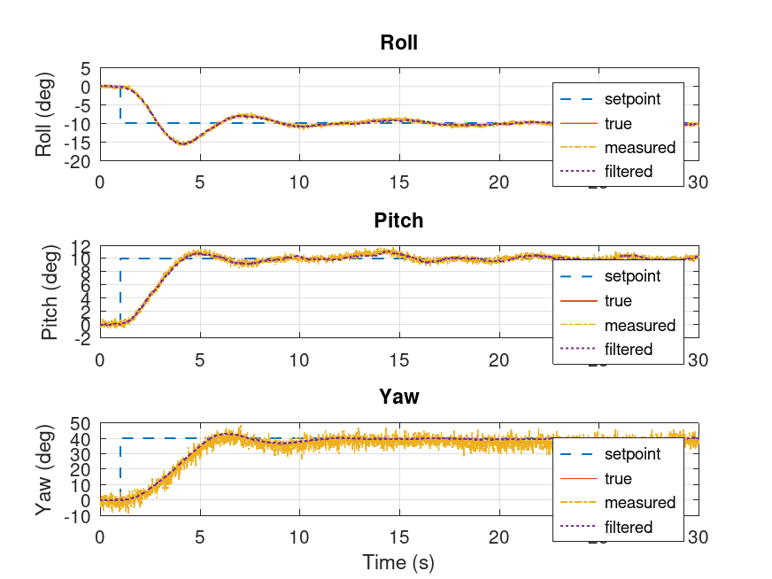

# Contents of the repository

## [Flywheel Placement Simulation](.octave/tilt_sweep.m)

The three reaction wheels are arranged symmetrically around the satellite body:

- Each wheel is tilted **54.736° from the Z-axis** (vertical).
- Wheels are evenly spaced around the Z-axis at **azimuths 0°, 120°, and 240°**.

This configuration was chosen to maximize torque authority in all directions:

- The **condition number** of the wheel-axis matrix is ~1, meaning torque capability is nearly equal along all three body axes.
- The **singular values** are almost identical, confirming there are no weak axes.

This ensures that the floatsat can rotate equally efficiently around roll, pitch, and yaw.

> The same conclusion can be made empirically by rotating the object by 45° twice :^)

## [Octave Control Simulation](octave/floatsat_sim.m)

A simulation made in Octave to get a better grasp on the dynamics of the system and to brainstorm the control structure.

Example run:

